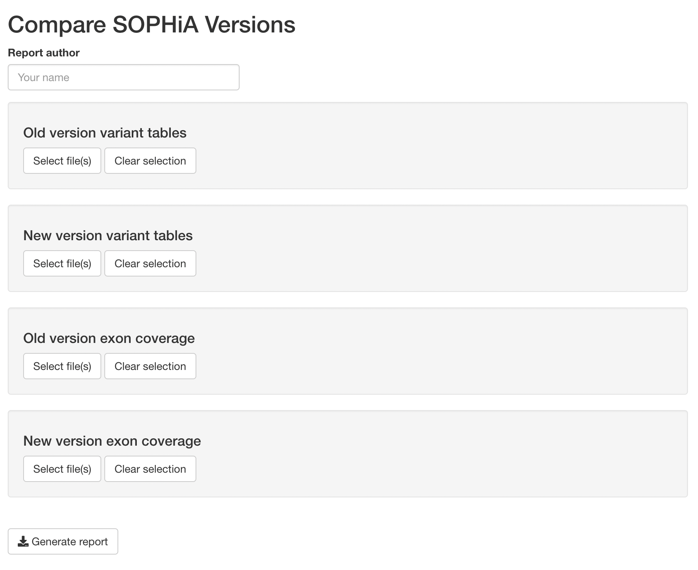

```{r setup, include=FALSE}
knitr::opts_chunk$set(echo = TRUE)
```

## Getting started

This guide walks through the steps for using the `UNCMolGen` R package to compare the output from two SOPHiA DDM versions. 
First, the user must install the [R](https://cran.r-project.org), [RStudio](https://www.rstudio.com), and (if on Windows) [RTools](https://cran.r-project.org/bin/windows/Rtools/). 
If already installed, skip to the next section.

If installing for the first time, users must also install the UNCMolGen package by running the following code in RStudio:

```{r, eval=FALSE}
if (!"remotes" %in% installed.packages()) install.packages("remotes")
if (!"UNCMolGen" %in% installed.packages()) {
  remotes::install_github("daynefiler/UNCMolGen", 
                          dependencies = TRUE, 
                          build_vignettes = TRUE)
} 
```

## Using ddmValidation function to compare SOPHiA DDM versions

To compare two versions, the user only needs to load the `UNCMolGen` package and call one function: `ddmValidation()`. 

```{r,eval=FALSE}
library(UNCMolGen) ## Load the package
ddmValidation()
```

After running the function, a screen should popup with the following:

```{r,}

```

The user then enters their name in the author field and selects the appropriate SOPHiA DDM output file(s) for each version (old & new).
The function compares both the `"full_variant_table.txt"` and the `"exon_coverage_stats.txt"` files provided by SOPHiA DDM.
The user can add multiple files for each category.


